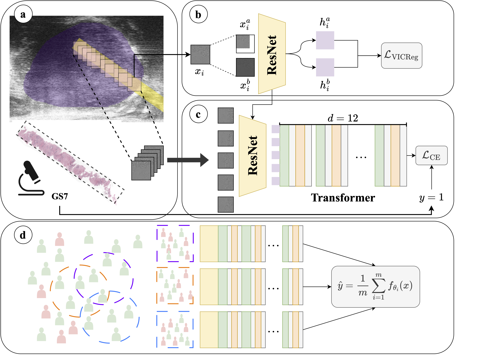

## TRUSWorthy: Towards Clinically Applicable Deep Learning for Confident Detection of Prostate Cancer in Micro-Ultrasound



## Preliminary
This code represents a significant portion of the code used to generate the results for our paper. The models are implemented in `projects/TRUS_ViT/models`. There are several types of models implemented:

- The ResNet (dubbed `ResNet10` in the code) model is implemented in `src/modeling/registry.py`, and a wrapper `ResNet10Experiment` is provided in `projects/TRUS_ViT/models/resnet.py` for training, validation, and testing.

- SSL+ResNet uses the same ResNet10 backbone as above, but is trained using the logic of `projects/TRUS_ViT/models/vicreg.py`. 

- The TRUSformer architecture uses the SSL+ResNet architecture as a feature extractor, and the `TransformerEncoder` (BERT) architecture implemented in `src/modeling/bert.py` as a MIL aggregator. 

## Training a model
### Single-model baselines
To train a single-model architecture, we use the bash scripts located in `projects/TRUS_ViT/job_submission`. These scripts parse a set of hyperparameters outlined in a `.yaml` file in `projects/TRUS_ViT/experiments`. For example:

```yaml
augmentations_mode: tensor_augs
batch_size: 64
device: cuda

fold: 0
lr: 3e-4
model_name: resnet10
num_epochs: 25

seed: 42
```

### Ensemble baselines

To train an $n$-Deep Ensemble, we need to initialize each model with a different seed. We can set the hyperparameters inside the job submission such as:

```bash
python main.py experiment=resnet10 seed=42 fold=0
python main.py experiment=resnet10 seed=81 fold=0
python main.py experiment=resnet10 seed=881 fold=0
python main.py experiment=resnet10 seed=392 fold=0
python main.py experiment=resnet10 seed=659 fold=0
```

The code above trains an ensemble of 5 ResNets on folds 1,2,3,4 and evaluates it on fold 0.

We can also train an ensemble of TRUSformers using:
```bash
python main.py experiment=trusformer seed=42 fold=0
python main.py experiment=trusformer seed=81 fold=0
python main.py experiment=trusformer seed=881 fold=0
python main.py experiment=trusformer seed=392 fold=0
python main.py experiment=trusformer seed=659 fold=0
```

### Mixed deep ensembles
We can train a TRUSWorthy model using the same code presented above. The only difference is that we are also resampling the set of benign cores seen by the model during training using the same seed specified in the experiment `.yaml` file. 

To enable this, we use the `mix_ens` flag, which sends the seed to the data loader to be used during sampling (when `mix_ens=false`, the data loader's seed is set to 0).

```bash
python main.py experiment=trusformer mix_ens=true seed=42 fold=0
python main.py experiment=trusformer mix_ens=true seed=81 fold=0
python main.py experiment=trusformer mix_ens=true seed=881 fold=0
python main.py experiment=trusformer mix_ens=true seed=392 fold=0
python main.py experiment=trusformer mix_ens=true seed=659 fold=0
```

## Hyperparameter tuning
### Summary
We summarize the full range of hyperparameters used for every component of the model (VICReg,ResNet,TRUSformer, Mixed Ensembling) below, and indicate the final combination of hyperparameters used. The hyperparameters live in the `.yaml` files in the `experiments` folders. We provide more details on each hyperparameter in the subsections below.

**VICReg**
```yaml
lr: 1e-4, 1e-5
scheduler: none, cosine
batch_size: 16, 32, 64
optimizer: adam, novograd
augmentations_mode: both
```

**ResNet**
```yaml
lr: 1e-4, 1e-5
scheduler: none, cosine
batch_size: 16, 32, 64
optimizer: adam, novograd
benign_to_cancer_ratio: 1, 2, 5
augmentations_mode: none, tensor_augs,
                    ultrasound_augs, both
```

**TRUSformer** (single-model)
```yaml
lr: 1e-4, 1e-5
scheduler: none, cosine
batch_size: 8
optimizer: adam, novograd
benign_to_cancer_ratio: 1, 2, 5
augmentations_mode: none
```

**TRUSWorthy** (mixed ens.)
```yaml
lr: 1e-4, 1e-5
scheduler: none, cosine
batch_size: 8
optimizer: adam, novograd

# the following hyperparams are external (see above)
number of members: 4, 6, 8, 10
```

#### Best hyperparameter values
```yaml
VICReg:
    lr: 1e-4, 1e-5
    scheduler: cosine
    batch_size: 64
    optimizer: novograd
    num_epochs: 200 # we use early stopping
ResNet:
    lr: 1e-5
    scheduler: none
    batch_size: 64
    optimizer: adam
    num_epochs: 15
    benign_to_cancer_ratio: 2
    augmentations_mode: tensor_augs
TRUSformer:
    lr: 1e-4
    scheduler: none
    batch_size: 8
    optimizer: novograd
    num_epochs: 75 # early stopping
    benign_to_cancer_ratio: 2
    augmentations_mode: none
```

### Tuning procedure
To tune a hyperparameter $h_0$, we start by fixing all other parameters $h_i \forall i \ne 0$ to their default values (as indicated by the literature) and varing the value of $h_0$ in the experiment `.yaml` file. 

Once we establish the best value for $h_0$, we move onto $h_1$, then $h_2$, until we have tuned all the hyperparameters considered.

For our purposes, we started with the learning rate (and the schedulers), then the batch size, then the optimizers. We also tuned the type of data augmentations (`augmentations_mode`), the number of epochs, and the undersampling ratio.


## Cross-validation
By default, $k$-fold cross-validation is enabled through the following parameter in the experiments file
```yaml
cross_val: true
```

To perform leave-one-center-out cross-validation, the following combination of parameters should be used:
```yaml
cross_val: true
kfold_centerwise: true
```

## Ensembling of predictions
After we train $n$ models with different seeds, we export their predictions and average them together to compute the ensemble's predictions.

This logic is presented in `notebooks/trusworthy_results.ipynb`. We are unable to share the result files themselves at this time. 
